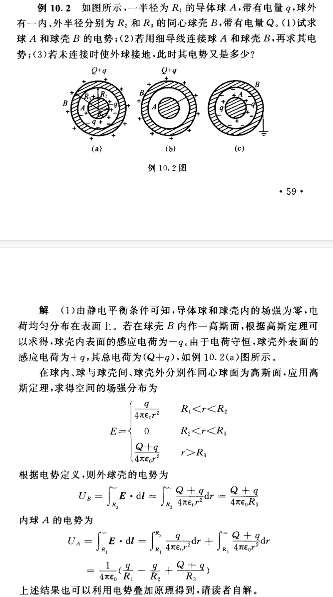

!!! info "about"
    - 电磁学为主
    - 基础知识

## 真空中的静电场
### 电场 电场强度

==场强公式==

$$
dE = \frac{1}{4\pi \varepsilon_0}\frac{dq}{r^2}e_r
$$

==电场强度叠加原理==
	点电荷系所产生的电场在某店的场强等于各点电荷单独存在时所产生的电场在该点的场强的矢量和。

==对电荷连续分布的带电体，可按不同的电荷分布方式写出场强公式==

$$
E = \frac{1}{4\pi \varepsilon_0} \int_{l}\frac{\lambda dl}{r^2}e_r
$$

$$
E = \frac{1}{4\pi \varepsilon_0} \int_{S}\frac{\sigma dS}{r^2}e_r
$$

$$
E = \frac{1}{4\pi \varepsilon_0} \int_{V}\frac{\rho dV}{r^2}e_r
$$

==电偶极子==
一对等量一号点电荷$+q$和$-q$,相距为$l$。当从观察点到两电荷连线距离的距离$x\gg l$时，则这一对点电荷称 ==电偶极子== ，定义电偶极矩$p_c = ql$。

### 电场线  电通量

==电场线== 有如下的重要性质：
- 电场线起自正电荷，终止于负电荷，不会在无电荷处终断。
- 任意两条电场线不会相交。
- 静电场中的电场线不形成闭合曲线。

==电通量==

$$
d\Phi_e =EdS\cos\theta =E·dS
$$

$$
\Phi_e=\oint_{s}E\cos\theta dS
$$

### 高斯定理及其应用

==通过任意闭合曲面的电通量等于该去面所包围的所有电量的代数和除以$\varepsilon_0$==

$$
\Phi_e=\oint_{s}E·dS=\frac{1}{\varepsilon_0}\sum_i q_i
$$

## 电场强度与电势梯度

$$
E_l=-\frac{dU}{dl}
$$

上式表示，电场中某点场强在任一方向上的分量等于电势在此方向上变化率地负值。

$$
E=-\frac{dU}{dn}e_n=-grad\ U
$$

其中$n$为法线。

$$
E=-(\frac{\partial U}{\partial x}i+\frac{\partial U}{\partial y}j+\frac{\partial U}{\partial z}k)
$$

## 静电场中的导体和电介质

### 静电场中的金属导体

#### 导体的静电平衡

现在将一个不带电的金属导体置于外电场$E_0$中，在电场力作用下，导体内部的自由电子将逆着电场方向相对晶体点阵作宏观定向运动，结果引起导体上电荷的重新分布，使导体两端带上等量异号的电荷，这就是导体的 ==静电感应现象== 。因静电感应而在导体表面出现的电荷称为 ==感应电荷== 。

处于静电平衡状态的导体有如下性质：
- 导体内部场强处处为$0$。
- 导体表面外侧，紧靠表面处的场强处处与表面垂直。
- 导体是一个等势体，导体表面是个等势面。

#### 静电平衡时导体上的电荷分布
##### ==电荷分布在导体外表面上==
##### 电荷面密度与场强的关系
导体表面附近的场强与该处导体表面的电荷面密度成正比

$$
\oint_S E·dS=E\varDelta S=\frac{\sigma}{\varepsilon_0}
$$

==导体表面的场强为==

$$
E=\frac{\sigma}{\varepsilon_0}
$$

##### 电荷面密度与导体表面曲率的关系
对于孤立的带电导体来说实验证明，其电荷面密度$\sigma$与表面曲率有关，曲率大的部分，电荷面密度$\sigma$值较大；曲率小的部分，$\sigma$值较小；表面凹进去的部分曲率为负值,$\sigma$值更小。

#### 静电屏蔽

如前所述，置于静电场中的导体空腔达到静电平衡时，空腔内部没有电场，电场线只能从导体外表面发出或终止，即使外部电场发生变化，也只能引起导体空腔外表面上电荷的重新分布。这样，导体壳对外界静电场起了“隔离“作用，这种现象称为 ==静电屏蔽== 。利用这一性质，可以将一些精密仪器放置在空腔内，以避免外界电场的影响。

### 电容 电容器
定义孤立导体的电容如下

$$
C=\frac{Q}{U}
$$

真空中孤立导体的电容的值只取决于导体的几何形状和尺寸。以 ==孤立导体球== 为例，若带电量为$q$,则该球的电势$U=q/(4\pi \varepsilon_0R)$ ,那么有

$$
C=4\pi \varepsilon_0R
$$

表明电容$C$只与导体的几何性质有关，而与导体上所带的电量无关。

![[截屏2024-09-21 16.38.10.png]]
![[截屏2024-09-21 19.14.29.png]]

#### 电容器的串联与并联
##### 串联

$$
\frac{1}{C}=\frac{1}{C_1}+\frac{1}{C_2}+···+\frac{1}{C_n}
$$

==耐压程度明显提高==

##### 并联

$$
C=C_1+C_2+···+C_n
$$

### 静电场中的电介质

#### 电介质对电场的影响

$$
U=\frac{U_0}{\varepsilon_r}
$$

$$
C=\varepsilon_rC_0
$$

==其中$\varepsilon_r$为仅与电介质有关的常数，称电介质的相对介电常数(或相对电容量)。我们规定真空中的$\varepsilon_r$为1。==

#### 极化强度  极化面密度

我们在电介质中任取一体积元$\varDelta V$，此体积元在宏观上足够小，但在微观上足够大，使其中包含大量的分子。我们对该体积元中所有分子电矩$p_i$取矢量和，并引入 ==极化强度$P$,定义为介质中单位体积内分子电矩之矢量和== ，即

$$
P=\frac{\sum p_i}{\varDelta V}
$$

实验证明，当外加电场不太强时，对大多数各向同性电介质来说，$P$和$E$有如下关系

$$
P=\varepsilon_0 \chi_cE
$$

其中$\chi_c$是与电介质性质有关的比例系数，称为 ==电极化率== 。
![[截屏2024-09-22 16.09.14.png]]

### 电介质中静电场的基本定理

#### 电介质中的场强

![[截屏2024-09-22 16.20.33.png]]
同时可以得到

$$
\sigma'=\sigma_0(1-\frac{1}{\varepsilon_r})
$$

==电场环路定理==

$$
\oint\vec E·d\vec l =0
$$

==高斯定理(存在极化电介质的情况下)==

$$
\oint\vec E·d\vec S=\frac{\sum q}{\varepsilon_0}=\frac{1}{\varepsilon_0}(\sum q_0-\sum q')
$$

==真空中==有

$$
\oint \vec E·d\vec S=\frac{\sum q_0}{\varepsilon_0}
$$

==电位移概念的引出==

$$
\oint \vec E·d\vec S=\frac{1}{\varepsilon_0}(\sigma_0\varDelta S-\sigma'\varDelta S)
$$

$$
\oint \vec P·d\vec S=\sigma'\varDelta S
$$

由以上两式可以得到

$$
\oint (\varepsilon_0\vec E+\vec P)·d\vec S=\sum q_0=\sigma_0\varDelta S
$$

令

$$
D=\varepsilon_0\vec E+\vec P
$$

有

$$
\oint D·d\vec S=\sum q_0
$$

==它表明，通过电场中任意闭合曲面的电位移通量，等于该闭合面所包围的自由电荷的代数和。==

对于 ==各向同性电介质== 有

$$
D=\varepsilon_0\vec E+\vec P=\varepsilon_0\vec E+\varepsilon_0\chi_c\vec E=\varepsilon_0\varepsilon_r\vec E=\varepsilon\vec E
$$

### 静电场的能量

#### 点电荷系统的静电能

对于由$n$个点电荷组成的系统，用同样的方法可以证明，点电荷系统的相互作用能是

$$
W=\frac{1}{2}\sum_{i=1}^{n}q_iU_i
$$

同理有

$$
W=\frac{1}{2}\int_{V}U\rho dV
$$

$$
W=\frac{1}{2}\int_SU\sigma dS
$$

#### 电容器的能量

$$
W=\frac{1}{2}\frac{Q^2}{C}=\frac{1}{2}Q(U_A-U_B)=\frac{1}{2}C(U_A-U_B)^2
$$

#### 电场的能量

根据，

$$
U_A-U_B=Ed,C=\varepsilon S/d
$$

可以得到如下公式，

$$
W=\frac{1}{2}C(U_A-U_B)^2=\frac{1}{2}\varepsilon E^2Sd=\frac{1}{2}\varepsilon E^2V
$$

而在平板电容器中电场是均匀的，所贮存的能量也应该是均匀分布，因此，单位体积内贮存的能量为

$$
w_e=\frac{W}{V}=\frac{1}{2}\varepsilon E^2=\frac{1}{2}DE
$$

==其中$w_e$称为电场能量密度，简称电能密度。==

## 稳恒磁场

$$
F=qv\times B
$$

$$
F=qE+qv\times B
$$

毕奥—萨法尔定律的矢量式表示

$$
dB=\frac{\mu_0}{4\pi}\frac{Idl\times r}{r^3}
$$

$$
B=\int dB=\frac{\mu_0}{4\pi}\int\frac{Idl\times r}{r^3}
$$

#### 长直载流导线的磁场
当导线长度$L\gg a$，$B=\frac{\mu_0I}{2\pi a}$.
一般情况下有$B=\frac{\mu_0I}{4\pi a}\int_{\theta_1}^{\theta_2}sin\theta d\theta=\frac{\mu_0I}{4\pi a}(cos\theta_1-cos\theta_2),\theta_1,\theta_2分别为载流直导线两端点对应的\theta角$

#### 载流圆线圈的磁场
一般情况下有

$$
B=\frac{\mu_0IR^2}{2(R^2+x^2)^\frac{3}{2}}
$$

$x=0时有B(0)=\frac{\mu_0I}{2R}$

$若圆线圈密绕有N匝，则有B(0)=\frac{\mu_0NI}{2R}$

#### 在流线圈的磁矩 磁偶极子

$$
p_m=NISe_n
$$

$$
B=\frac{\mu_0p_m}{2\pi x^3}
$$

#### 载流直螺线管的磁场

$$
B=\frac{\mu_0}{2}nI(cos\beta_2-cos\beta_1)
$$

$当螺线管为无限长，B=\mu_0 nI$
$在螺线管轴线上的两个端点处 B=\frac{1}{2}\mu_0 nI$

#### 无限长均匀载流薄铜片的磁场

$$
B=\frac{\mu_0I}{\pi a}arctan\frac{a}{2y}
$$

$a为载流无限长薄铜板的宽度$

#### 磁场的高斯定理 安培环路定理

通过磁场中任意闭合曲面的磁通量恒等于零

$$
\Phi_m=\oint_sB·dS=0
$$

在稳恒磁场中，磁感应强度$B$沿任意闭合回路的线积分，等于闭合回路所包围电流代数和的$\mu_0$倍，其数学表达式为

$$
\oint_LB·dl=\mu_0 \sum I_内
$$

### 磁场对电流的作用

$$
dF=Idl\times B
$$

#### 平行长直载流导线间的作用力

$$
安培力大小为\frac{\mu_0I_1I_2}{2\pi d}\ \  \mu_0=4\pi\times10^{-7}N/A^2
$$

![[截屏2024-10-29 14.52.09.png]]
若线圈有$N$匝，则线圈所受的力矩为

$$
M=NBISsin\theta
$$

$$
M=p_m\times B,p_m=NISe_n
$$

$p_m为载流线圈的磁矩$

#### 磁力所做的功

$$
A=I\Delta\Phi
$$

$$
A=\int_{\phi_1}^{\phi_2}Id\Phi
$$

#### 霍尔效应

处在均匀磁场中的通电导体薄板，当电流方向与磁场方向垂直时，则在垂直于磁场和迪纳流方向上的薄板上、下两端之间出现电势差，这一现象称为霍尔效应，出现的电势差称为霍尔电势差。霍尔电势差$U_H$与通过导体薄板的电流强度$I$、磁场的磁感应强度$B$成正比，而与板的厚度$d$成反比，即

$$
U_H=R_H\frac{BI}{d}
$$

在两端面之间建立起一个沿$+x$方向的附加电场$E_H$,称为霍尔电场。

$$
qE_H=qvB,E_H=vB
$$

$$
U_H=E_Hl=vbl,I=nqvs=nqvld
$$

$$
代入得U_H=\frac{1}{nq}\frac{IB}{d}
$$

## 磁场中的磁介质

### 磁介质的分类

置于静电场中的电介质由于电极化而激发附加电场，并对原电场产生影响。与此类似，置于磁场中的磁介质会被磁化，磁化了的磁介质会激发附加磁场，对原磁场产生影响。磁介质中的磁感应强度$B$，应等于真空中原来磁场的磁感应强度$B_0$和附加磁场的磁感应强度$B'$之和，即

$$
B=B_0+B'
$$

### 顺磁质和抗磁质的磁化

#### 磁化强度和磁化电流

为了描述磁介质在外磁场中磁化的程度和磁化方向，我们引入一个宏观物理量磁化强度，并将磁介质内某点处单位体积内分子总磁矩（即分子固有磁矩和附加磁矩）的矢量和定义为该点的磁化强度，用符号$M$表示。

$$
M=\frac{\sum_{i}p_m}{\Delta V}
$$

![[截屏2024-10-29 16.01.34.png]]
![[截屏2024-10-29 16.01.53.png]]

磁化强度$M$沿任意闭合回路$L$的线积分，等于通过该回路所包围面积的磁化电流强度的代数和,

$$
\oint_LM·dl=\sum_{L内}I_m
$$

### 存在磁介质时磁场的基本规律
#### 磁场强度 有磁介质时的安培环路定理

将真空中稳恒磁场的安培环路定理推广到介质中，安培环路定理应表示为

$$
\oint_LB·dl=\mu_0(\sum I_0+\sum I_m)
$$

由于磁化电流的分布不能直接测量，所以计算$B$的环流相当困难。为了简化计算，我们利用磁化电流与磁化强度之间的关系，对上式进行变换，

$$
\oint_LB·dl=\mu_0(\sum I_0+\oint_LM·dl)
$$

$$
即\oint_L(\frac{B}{\mu_0}-M)·dl=\sum I_0
$$

同时引入一个新的物理量磁场强度，用符号$H$表示，令，

$$
H=\frac{B}{\mu_0}-M
$$

$$
于是有\oint_LH·dl=\sum I_0
$$

上式就是有磁介质时的安培环路定理。它表明，磁场强度$H$沿任意闭合路径$L$的环流，等于穿过该路径所谓面积的传导电流的代数和。

#### 存在磁介质时的磁场高斯定理

$$
\oint_SB·dS=\oint_s(B_0+B')·dS=0
$$

#### $B、M、H$之间的关系

$$
B=\mu_0H+\mu_0M
$$

$$
M=\chi_mH
$$

$$
B=\mu_0(1+\chi_m)H
$$

$$
通常令 \mu_r=1+\chi_m\ \ \mu_0\mu_r=\mu
$$

$\mu_r$称为磁介质的相对磁导率。

$$
B=\mu_o\mu_rH
$$

 管内存在介质时磁感应强度是无介质是的$\mu_r$倍。